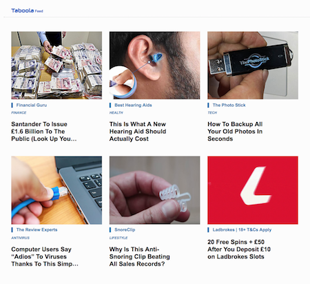
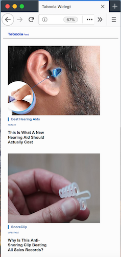

<h1 align="center">
  Taboola Widget
</h1>
It's a simple responsive Taboola widget for desktop and a tablet.
For reference, you can see a live responsive Taboola widget at the bottom of the article on this page: https://www.laprovence.com/article/economie/5463283/les-projets-novateurs-des-jeunes-entrepreneurs-marseillais.html

IMPORTANT: <br>
*You can only use pure HTML, CSS, and JavaScript to build and display the widget. Do not use any external libraries (e.g. jQuery, Bootstrap).*

<div></div>

*Tags: HTML, CSS, Javascript*


# The App

### Install
Make sure you have a modern browser on your machine.

Clone or Download this repo to your local machine.

### Use
To use the app open your favourite browser, I've been using Firefox <br>
  i. Run `taboolaWidget.html` <br>
  ii. Open dev tools in your browser (mac `⌥  + ⌘ + i`)<br>
  iii. Toggle device tool bar ( for responsiveness )<br>

A screenshot example: (picture below)
<div></div>

## User Stories
I created the following user stories: <br>

```
To view the widget on my desktop or tablet,
I would like widgets to display as three columns and two rows (3x2).

To identify different widgets,
I want each item to contain a title and branding below each image.

To view widgets on my mobile,
I would like widgets to display as a column with six rows (1x6).

To access the a widget,
I would like the image, title and branding text to be clickable links that load the url.
```

## Approach
The primary reason I enjoyed this challenge is because I have predominately been working with javascript. I was confident the specification could be delivered.
I am comfortable working with Javascript now, which allows me to dedicate just as much thought to my process and methodology. <br>

My approach: <br>
- Read and understand the specification
- Translate the specification into key user stories
